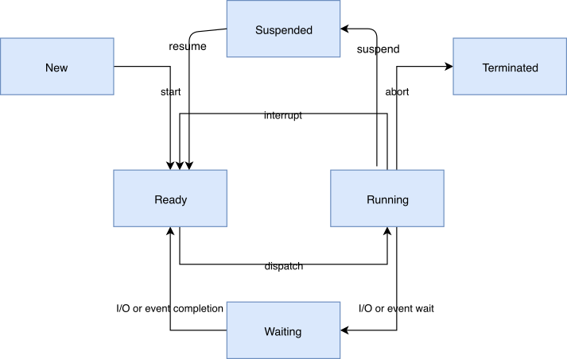

# Threads

## 1. Introduction

- **Stack area**: a region of memory used for the thread's stack. The size can be adjusted as required by the thread's processing.
- **Thread control block**: for internal bookkeeping of the thread's metadata. An instance of the type `k_thread`.
- **Entry point function**: invoked when the thread is started. Up to 3 argument values can be passed to this function. 
- **Scheduling policy**: intstructs the kernel's scheduler how to allocate CPU time to the thread. (See Scheduling)
- **Thread options**: allows the thread to receive special treatment by the kernel. (See Thread options)
- **Start delay**: specifies how long the kernel should wait before starting the thread.
- **Execution mode**: can be supervisor or user mode. By default, threads run in supervisor mode and allow access to privileged CPU instructions, the entire memory address space, and peripherals. User mode threads have a reduced set of privileges. (See User Mode)

## 2. Thread commands

### 2.1. k_thread_start()

A thread must be created before it can be used.

### 2.2. k_thread_join()
Sleep until a thread exits. 

For example:
- THREAD_1 is responsible for setting up a hardware interface
- THREAD_2 is responsible for processing data from this interface
- As long as THREAD_1 has not exited, THREAD_2 can't start, so we'll use k_thread_join(THREAD_1, timeout) in this case.

### 2.3. k_thread_abort()
Abort a thread. Thread is taken off all kernel queues.

### 2.4. k_thread_suspend()
Prevent a thread from executing for an indefinite period of time. Once suspended, use k_thread_resume() to re-start.

### 2.5. k_sleep()
A thread can prevent itself from executing for a specified amount of time. A sleeping thread becomes executable automatically once the time limit is reached.

## 3. Thread states
Ready: eligible to be selected as the next running thread.

Following factors can make a thread unready:
- Thread has not been started
- Waiting for a kernel object to complete an operation (for example, the thread is taking semaphore that is unavailable)
- Waiting for a timeout to occur
- Thread has been suspended
- Thread has terminated or aborted

## 4. Thread stack objects
- Use K_KERNEL_STACK macros if:
  - thread will never run in user mode
  - stack is being used for special contexts like handling interrupts
- Use K_THREAD_STACK macros if:
  - stack will need to host user threads

If CONFIG_USERSPACE is not enabled, K_THREAD_STACK macros have same effect as K_KERNEL_STACK.

## 5. Thread priorities
A thread's priority is an integer value, and can be either negative or positive. Numerically lower priorities take precedence over numerically higher values. 

Scheduler distinguishes two classes of threads based on their priority:
- Cooperative thread: has a negative priority value. Once it becomes the current thread, a cooperative thread remains the current thread until it performs an action that makes it unready.
- Preemptible thread: has a non-negative priority value. Once it becomes the current thread, a preemptible thread may be supplanted at any time if a cooperative thread, or a preemptible thread of higher or equal priority, becomes ready.

The priority of a thread can be changed, even after it has already started.

CONFIG_NUM_COOP_PRIORITIES and CONFIG_NUM_PREEMPT_PRIORITIES specify the number of priority levels for each class of thread.

## 6. Thread options

## 7. Thread custom data

## 8. Implementation

## 9. Runtime statistics

## 10. Suggested uses

## 11. Configuration options

## 12. API reference

