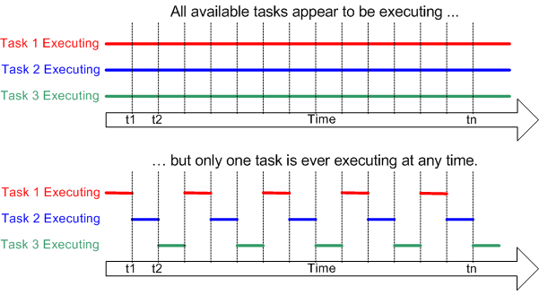
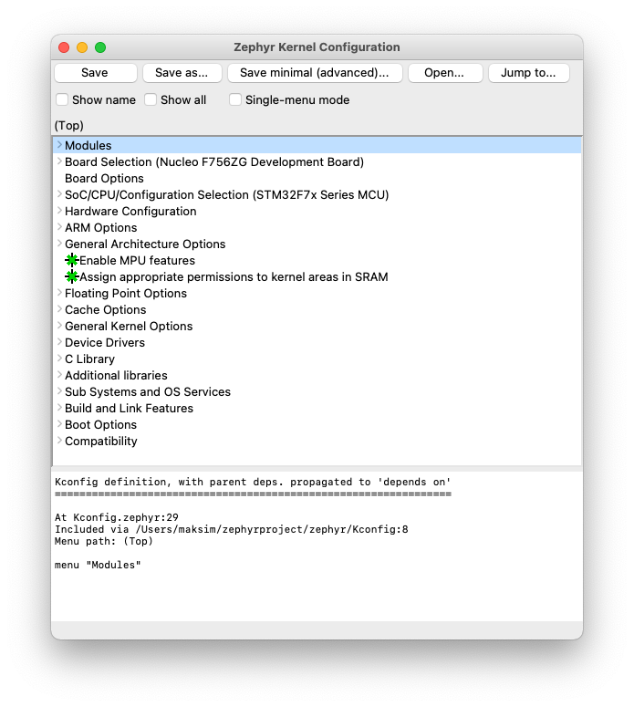

## 2. Setup
### 2.1. VSCode + PlatformIO + Zephyr RTOS

Starting off I used this setup, however once you start messing with more 'advanced' features of Zephyr, you will probably have to make the transition to the `west` metatool.
  
### 2.2. VSCode + West + Zephyr RTOS

The 'recommended' way to use Zephyr. (I will be using this one)

Setup: [link](https://docs.zephyrproject.org/latest/getting_started/index.html)


### 2.3. Eclipse + Plugin + Zephyr RTOS
Relevant [section](https://docs.zephyrproject.org/latest/application/index.html?highlight=eclipse#debug-with-eclipse) in Zephyr Documentation.

- Zephyr-plugin doesn't work with the latest Eclipse. ([github-issue](https://github.com/zephyrproject-rtos/eclipse-plugin/issues/45))
- However if you use an older version it should work apparently. (haven't tested this myself)

Setup: [link](https://docs.zephyrproject.org/latest/application/index.html?highlight=eclipse#debug-with-eclipse)

## 3. The Basics

### 3.1. RTOS basics

Before going any further it might be useful to quickly go over some basic RTOS concepts.

First: what is an RTOS? It is an operating system that is intended to serve real-time applications. Typical time requirement are below 0.01s. Two types of systems can be identified:
- Event-driven: switch tasks based on their priorities
- Time-sharing: switch the task based on clock interrupts



Some key concepts:
- **Kernel**: the core component within an operating system. Takes care of scheduling the tasks in such a way that they *appear* to be happening simultanously.
- **Task**: Each executing program is a task (or thread) under control of the operating system.
- **Scheduler**: part of the kernel responsible for deciding which task should be executing at any particular time. The scheduling policy decides which task to execute at any point in time.
- **Context**: as a task executes it uses the registers and memory. The processor registers, stack, etc compromise the task execution context. On switching to a task the RTOS is responsible to set the context back to the way it was at the moment it got pre-empted the previous time. The process of saving the context of a task being suspended and restoring the context of a task being resumed is called context switching.

source: [wikipedia](https://en.wikipedia.org/wiki/Real-time_operating_system), [freertos](https://www.freertos.org/implementation/a00004.html), [zephyr](https://docs.zephyrproject.org/latest/reference/kernel/index.html)

### 3.2. Zephyr-specific

A Zephyr application directory has the following components:
- **CMakeLists.txt**: your build settings configuration file - this tells west (really a cmake build system under the hood) where to find what it needs to create your firmware. For more advanced projects, it's also used for debug settings, emulation, and other features.
  
```
cmake_minimum_required(VERSION 3.13.1)
find_package(Zephyr REQUIRED HINTS $ENV{ZEPHYR_BASE})
project(blinky)

target_sources(app PRIVATE src/main.c)
```
*samples/basic/blinky/CMakeLists.txt*

- **prj.conf**: the Kernel configuration file. For most projects, it tells Zephyr whether to include specific features for use in your application code - if you use GPIO, PWM, or a serial monitor, you’ll need to enable them in this file first. Sometimes also referred to as Kconfig file. There is also something of a [GUI](https://docs.zephyrproject.org/2.4.0/guides/kconfig/menuconfig.html) which is helpful to get started.

*guiconfig*

- **src/main.c**: your custom application code - where the magic happens! It’s advisable to put all of your custom source code in a `src/` directory like this so it doesn’t get mixed up with your configuration files.

Once you have succesfully built an application a build folder will appear within your directory. The following files are interesting to take a look at:
- **build/zephyr/zephyr.dts**: CMake uses a devicetree to tailor the build towards your specific architecture/board. A more in-depth discussion of devicetree follows a bit later.
- **build/zephyr/.config**: To check the final Kconfig used for your built. This can be useful to verify if a setting has been set correctly.

<!-- ### 3.3. gdb

In order to be able to debug multi-threaded systems, you will need to be able to use `gdb`. (In the examples we'll go step-by-step over some commonly used debugging techniques)

[Youtube playlist explaining lots of common debugging techniques](https://www.youtube.com/watch?v=mfmXcbiRs0E&list=PL9IEJIKnBJjHGWPN_S9NS_Ky1-tC8ZrUI) 

### 3.4. CMake

At some point it is recommended to understand how CMake works. (Probably not right away though, so feel free to skip this one for now)

[Video Tutorial](https://www.youtube.com/watch?v=nlKcXPUJGwA&list=PLalVdRk2RC6o5GHu618ARWh0VO0bFlif4)

[Wiki CMake Tutorial](https://cmake.org/cmake/help/latest/guide/tutorial/index.html) -->

## 4. Kernel Services
In this section we'll go over all the services available using the Zephyr kernel.

The text and format is based on the [Zephyr Api](https://docs.zephyrproject.org/latest/reference/kernel/index.html), these are just my condenced notes for that section.

### 4.1. Scheduling, Interrupts and Synchronization
#### 4.1.1. Threads
- See [kernel_threads.md](https://github.com/maksimdrachov/zephyr-rtos-tutorial/blob/main/kernel_threads.md)

#### 4.1.2. Interrupts
- See [kernel_interrupts.md](https://github.com/maksimdrachov/zephyr-rtos-tutorial/blob/main/kernel_interrupts.md)

#### 4.1.3. Scheduling
- See [kernel_scheduling.md](https://github.com/maksimdrachov/zephyr-rtos-tutorial/blob/main/kernel_scheduling.md)

#### 4.1.4. Semaphores
- See [kernel_semaphores.md](https://github.com/maksimdrachov/zephyr-rtos-tutorial/blob/main/kernel_semaphores.md)

#### 4.1.5. Mutexes
- See [kernel_mutexes.md](https://github.com/maksimdrachov/zephyr-rtos-tutorial/blob/main/kernel_mutexes.md)

### 4.2. Data Passing

#### 4.2.1. Queues
- See [kernel_queues.md](https://github.com/maksimdrachov/zephyr-rtos-tutorial/blob/main/kernel_queues.md)

#### 4.2.2. FIFOs
- See [kernel_fifos.md](https://github.com/maksimdrachov/zephyr-rtos-tutorial/blob/main/kernel_fifos.md)

#### 4.2.3. LIFOs
- See [kernel_lifos.md](https://github.com/maksimdrachov/zephyr-rtos-tutorial/blob/main/kernel_lifos.md)

#### 4.2.4. Stacks
- See [kernel_stacks.md](https://github.com/maksimdrachov/zephyr-rtos-tutorial/blob/main/kernel_stacks.md)

#### 4.2.4. Message Queues 
- See [kernel_message_queues.md](https://github.com/maksimdrachov/zephyr-rtos-tutorial/blob/main/kernel_message_queues.md)

#### 4.2.4. Mailboxes 
- See [kernel_mailboxes.md](https://github.com/maksimdrachov/zephyr-rtos-tutorial/blob/main/kernel_mailboxes.md)

#### 4.2.4. Pipes 
- See [kernel_pipes.md](https://github.com/maksimdrachov/zephyr-rtos-tutorial/blob/main/kernel_pipes.md)

### 4.3. Memory Management

#### 4.3.1. Memory heaps 
- See [kernel_memory_heaps.md](https://github.com/maksimdrachov/zephyr-rtos-tutorial/blob/main/kernel_memory_heaps.md)

#### 4.3.2. Memory slabs 
- See [kernel_memory_slabs.md](https://github.com/maksimdrachov/zephyr-rtos-tutorial/blob/main/kernel_memory_slabs.md)

### 4.4. Timing

#### 4.4.1. Kernel Timing
- See [kernel_timing.md](https://github.com/maksimdrachov/zephyr-rtos-tutorial/blob/main/kernel_memory_timing.md)

#### 4.4.2. Timers
- See [kernel_timers.md](https://github.com/maksimdrachov/zephyr-rtos-tutorial/blob/main/kernel_timers.md)

### 4.5. User Mode

<!-- ## 5. Devicetree guide
- [ ] See [devicetree_guide.md](https://github.com/maksimdrachov/zephyr-rtos-tutorial/blob/main/devicetree_guide.md) -->

<!-- ## 5. Advanced topics

For discussing more 'advanced' topics using Zephyr (such as networking, bluetooth,...), I have created a seperate [repository](https://github.com/maksimdrachov/zephyr-rtos-advanced-tutorial). -->


## 5. Examples
Location: `~/zephyrproject/zephyr/samples`

Basic examples useful to study for beginners are discussed here: [examples_west.md](https://github.com/maksimdrachov/zephyr-rtos-tutorial/blob/main/examples_west.md)

More advanced examples are discussed here: [examples_adv.md](https://github.com/maksimdrachov/zephyr-rtos-tutorial/blob/main/examples_adv.md)

## 6. Tests
Location : `~/zephyrproject/zephyr/tests`

## 8. Projects using Zephyr RTOS
- [Air-quality sensor](https://github.com/ExploratoryEngineering/air-quality-sensor-node)
- [Pinetime-hypnos](https://github.com/endian-albin/pinetime-hypnos)
- [RT-Loc](https://github.com/RT-LOC/zephyr-dwm1001) 
- [BLE Environmental Sensor](https://github.com/patrickmoffitt/zephyr_ble_sensor)
- [STM32 Artnet-node](https://github.com/maksimdrachov/stm32-artnet)